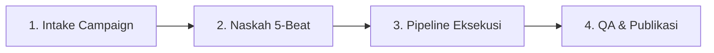

<div align="center">


# Whop Game Clipping
### *All-in-One Automation Bot & Video Pipeline for Whop Content Rewards*

[](LICENSE)
[](https://www.python.org/)
[](https://ffmpeg.org/)
[](#)
[](#)

<p align="center">
  <b>Automation Bot & Pipeline Cerdas untuk Whop Game Clipping: Mulai dari membaca aturan campaign, mengunduh aset, menghasilkan AI voiceover berkecepatan tinggi, meracik subtitle kinetik ASS kata-per-kata, hingga perakitan video dan audio mastering standar penyiaran secara otomatis.</b>
</p>

</div>

---

## 💡 Tentang Proyek

**Whop Game Clipping** adalah sistem robotika otomasi (*automation bot*) dan *rendering pipeline* cerdas yang **didesain khusus untuk para kreator klip game di program Whop Content Rewards & Game Publisher Campaigns**.

Program *clipping reward* di ekosistem Whop menuntut kreator untuk memproduksi puluhan video pendek setiap minggunya dengan standar kualitas tinggi: tidak boleh membosankan (*high retention*), hook awal harus langsung menyengat penonton, teks subtitle harus dinamis, dan ketentuan sponsor/campaign harus dipatuhi 100%.

Mengedit secara manual membutuhkan waktu 1–2 jam per video. **Whop Game Clipping memangkas seluruh alur tersebut menjadi hitungan detik**:
Bot membaca aturan kampanye, mengunduh footage aset klip, menulis naskah retensi tinggi, memproduksi suara AI alami, membuat subtitle pop kinetik, merender komposisi video ambient backdrop 9:16, dan melakukan mastering audio profesional secara otomatis.

---

## ⚡ Quick Start (Setup Cepat dalam 3 Menit)

Mulai gunakan pipeline ini hanya dengan 4 langkah mudah:

### 1. Kloning Repositori
```bash
git clone https://github.com/widisaadi/whop-game-clipping.git
cd whop-game-clipping
```

### 2. Pasang Dependensi Python
```bash
pip install -r requirements.txt
```
*(Opsional: Disarankan menggunakan virtual environment: `python -m venv venv` lalu aktifkan).*

### 3. Masukkan API Key Gemini
Salin template konfigurasi dan masukkan Google Gemini API Key Anda ([Dapatkan gratis di Google AI Studio](https://aistudio.google.com/app/apikey)):
```bash
# Windows (PowerShell):
Copy-Item .env.example .env

# macOS / Linux:
cp .env.example .env
```
Isi file `.env`:
```env
GEMINI_API_KEY=AIzaSyYourActualAPIKeyHere...
```

### 4. Uji Coba Kesiapan Sistem
Jalankan verifikasi timeline untuk memastikan instalasi FFmpeg dan Python berjalan sempurna:
```bash
python scripts/render_retention.py campaigns/how_to_fisch/edits/09_fish_fight_back.json --dry-run
```
✅ **Selesai!** Sistem Anda telah 100% siap memproduksi video clipping otomatis.

---

## 🚀 8 Pilar Otomasi Utama

Framework ini dibangun di atas 8 modul otomasi yang saling terhubung:

### 1. 🤖 Automation Bot Auto-Clip
Bot orkestrator yang mengeksekusi pipeline produksi dari ujung ke ujung (*end-to-end*). Anda cukup menentukan nama kampanye dan naskah/angle, dan sistem akan mengoordinasikan pemotongan klip, perakitan audio, penyelarasan subtitle, hingga render video final secara otomatis tanpa perlu membuka software video editor manual.

### 2. 📥 Download Asset & Inventory Manager
Modul pengunduh otomatis yang mampu mengambil aset footage mentah, materi branding, ikon game, musik latar, dan sound effect dari sumber cloud (seperti Google Drive atau MediaSilo) ke dalam folder lokal kampanye (`campaigns/<slug>/assets/`). Sistem secara otomatis mencatat manifest integritas file (`asset_manifest.json`) dan membuat katalog adegan visual (`footage_catalog.json`).

### 3. 📋 Baca & Ekstrak Aturan Campaign (Campaign Rules Parser)
SOP otomasi cerdas (`prompts/campaign_intake.md`) untuk membaca panduan Google Docs atau brief kampanye Whop. Sistem secara otomatis memisahkan:
- **Ketentuan Wajib (Mandatory):** Nama resmi game, penyebutan audio, batas durasi, dan format rasio.
- **Larangan Keras (Prohibited):** Klaim berlebihan (*fake hype*), footage di luar folder resmi, atau musik berhak cipta.
- **Kepatuhan Regulasi:** Format tagar (#Ad, #Sponsored) dan aturan FTC disclosure.
- **Call-to-Action (CTA):** Teks penutup resmi seperti *"Play on Roblox"* atau *"Link in Bio"*.

### 4. ✂️ Smart Video Editing Engine
Mesin penyunting berbasis FFmpeg tingkat lanjut yang memotong klip pada milidetik presisi, menyusun sekuens timeline dinamis, dan menerapkan *Constant Frame Rate* (CFR 30.00 fps) dengan color space BT.709 untuk menjamin tidak adanya frame freeze atau patah-patah pada transisi segmen.

### 5. 🎨 Visual Composition & Living Endcard
- **Framing Ambient Blurred Backdrop (1:1 Sharp Center):** Footage gameplay 16:9 ditempatkan tajam 1:1 di tengah layar vertikal 9:16 (1080×1920) dengan latar belakang cermin kabur (*mirror blur*). Ini menjamin elemen vital game (seperti UI tombol, health bar boss, kotak code, dan inventori) tidak terpotong tepi layar ponsel.
- **Living Endcard (Focal Center):** Penutup video beranimasi dengan layout presisi yang menampilkan kartu branding resmi game, judul game, dan teks ajakan bermain (CTA) yang bersih tanpa box hitam kaku.

### 6. 💬 Subtitle Impact Kinetic Pop (ASS Dynamic Engine)
Generator subtitle otomatis berekstensi `.ass` (*Advanced SubStation Alpha*) dengan standar retensi viral:
- Menggunakan tipografi tebal `Impact 96–102`.
- Outline pekat 8–9px hitam solid dan shadow 5–6px untuk kontras maksimal di atas latar gameplay apa pun.
- Animasi kinetik *pop* kata-per-kata dengan penekanan warna dinamis (Emas, Hijau, Merah, dan Putih) yang melompat mengikuti ketukan suara.

### 7. 🎙️ High-Velocity AI Voiceover ("Gaada Napas")
Integrasi generator vokal AI berbasis Google Gemini TTS (`Puck`, `Aoede`, `Achird`) yang diatur untuk menghasilkan gaya bercerita gaming yang antusias dan cepat. Dilengkapi algoritma pemangkasan jeda hening (*silence removal* untuk jeda >100ms) dan akselerasi vokal alami (`atempo=1.30..1.35`), menghasilkan delivery vokal padat (~3.8–4.1 kata per detik) yang tidak memberi celah bagi penonton untuk melakukan *swipe*.

### 8. 🎯 Didesain Khusus untuk Whop Clipping
Seluruh arsitektur, durasi (20–35 detik), rasio vertikal penuh, hingga arsitektur naskah disetel khusus untuk memenuhi indikator performa utama program **Whop Content Rewards**:
- Memaksimalkan retensi 2 detik pertama (lolos *swipe-through*).
- Menjaga Average Percentage Viewed (APV) tetap tinggi.
- Memenuhi seluruh kriteria verifikasi submission agar klaim reward disetujui tanpa penolakan.

---

## 🎬 Alur Pemakaian Sehari-hari (Production Workflow)

Setelah setup selesai, gunakan alur kerja 4 tahap berikut untuk memproduksi video baru:



### 1. Intake Campaign Baru
- Buat direktori kampanye di `campaigns/<nama_game_slug>/assets/clips/`.
- Letakkan video klip mentah gameplay resmi di folder tersebut.

### 2. Naskah & Semantik Visual 1:1
- Tulis naskah ringkas (80–120 kata) mengikuti formula 5-beat.
- Cocokkan kata kunci naskah dengan visual footage (misal kata *"treadmill"* harus menampilkan karakter di treadmill).

### 3. Eksekusi Otomatisasi
```bash
# A. Generate Voiceover AI alami
python scripts/gemini_tts.py

# B. Pangkas jeda hening > 100ms
python .agents/skills/ffmpeg-skill/scripts/silence.py temp/raw_tts.wav --stop-duration 0.10 --stop-threshold -35dB --output temp/voiceover_tight.wav

# C. Generate subtitle animasi ASS
python scripts/align_and_group_phrases.py

# D. Render video master final
python scripts/render_retention.py campaigns/how_to_fisch/edits/09_fish_fight_back.json
```

### 4. Audit Kepatuhan (QA)
```bash
python .agents/skills/ffmpeg-skill/scripts/check.py campaigns/how_to_fisch/output/01_final_video.mp4 --platform tiktok
```

---

## 💎 Formula Retensi 5-Beat (The 5-Beat Machine)

Setiap naskah video diatur dalam 5 beat psikologis retensi:

```
[0.0s - 2.0s]  Beat 1: Velocity Hook       -> Aksi kinetik cepat / premis kemustahilan tanpa basa-basi salam.
[2.0s - 6.0s]  Beat 2: Core Constraint     -> Aturan ekstrem atau batasan gameplay ("jumping is banned").
[6.0s - 9.0s]  Beat 3: The Absurd Tool     -> Mekanik tak terduga ("spitting tongue to make bridges").
[9.0s - 15.0s] Beat 4: Progression Grind   -> Multiplier scaling, leveling up, melintasi rintangan masif.
[15.0s - End]  Beat 5: Peak Tease & CTA    -> Pamer kekuatan dewa + Living Endcard & ajakan bermain.
```

---

## 🛠 Katalog Skrip Utama

| Skrip | Fungsi & Deskripsi |
| :--- | :--- |
| `scripts/gemini_tts.py` | Engine TTS Google Gemini dengan rotasi multi-key untuk mencegah limit kuota. |
| `scripts/batch_generate_10_voices.py` | Memproses 10 naskah video sekaligus dalam satu antrean batch render. |
| `scripts/render_retention.py` | Engine render utama berbasis FFmpeg dengan proteksi validasi timeline. |
| `scripts/align_and_group_phrases.py` | Menghitung durasi suku kata dan mengelompokkan kata menjadi frasa subtitle dinamis. |
| `.agents/skills/ffmpeg-skill/scripts/loudness.py` | Normalisasi audio penyiaran 2-Pass EBU R128 (`-14.0 LUFS`). |
| `.agents/skills/ffmpeg-skill/scripts/silence.py` | Pemangkas dead air otomatis tanpa distorsi artefak audio. |
| `.agents/skills/ffmpeg-skill/scripts/check.py` | Penguji integritas video untuk sertifikasi kelayakan upload platform. |

---

## 📁 Struktur Direktori Repositori

```text
whop-game-clipping/
├── .agents/                            # Skill agen AI & toolchain editing FFmpeg
├── assets/                             # Aset global, banner resmi, font, sfx, & sample clips
├── campaigns/                          # Direktori kerja modular per kampanye game
├── prompts/                            # Panduan sistem (SOP intake & retention script)
├── scripts/                            # Skrip generator audio, voiceover, dan render pipeline
├── shared/                             # Aset universal lintas campaign (intro hooks & sfx bank)
├── subtitles/                          # Arsip subtitle format ASS teruji
├── .env.example                        # Template konfigurasi variabel environment
├── .gitignore                          # Konfigurasi proteksi kredensial & file video besar
├── AGENTS.md                           # Standar emas operasional produksi resmi
├── LICENSE                             # Lisensi open-source MIT
├── README.md                           # Dokumentasi komprehensif ini
└── requirements.txt                    # Daftar dependensi Python
```

---

## 📝 Format Metadata SEO Pendamping

Setiap video final didampingi file metadata markdown (contoh: `01_how_to_fisch_metadata.md`):

```markdown
# Metadata Video — How to Fisch #01

### 1. Pilihan Judul (High CTR)
- **Option 1 (Curiosity Hook):** THIS ROBLOX FISHING GAME GETS ILLEGAL FAST...
- **Option 2 (Story Hook):** Why Did This Clam Just Pull Out a Shotgun on Me?
- **Option 3 (Algorithmic SEO):** How to Fisch Roblox Beginners Guide & Best Secret Rods
- **Option 4 (Question Hook):** Can You Survive the Giant Spider Crab in How to Fisch?

### 2. Deskripsi Algoritma
Think this is just another chill fishing game on Roblox? Think again! How to Fisch lets you battle mutant sea beasts with heavy weapons. 
👉 Play How to Fisch on Roblox now (Link in Bio)!

### 3. Hashtag Terkurasi
#Roblox #HowToFisch #RobloxGames #RobloxViral #GamingOnTikTok #FYP

### 4. Pinned Comment
"What level rod are you using right now? Drop your setup below 👇"
```

---

## ❓ FAQ & Troubleshooting

### 1. Error: `GEMINI_API_KEY environment variable is not set`
Pastikan file `.env` sudah dibuat di root folder dan memuat key yang valid:
```bash
# Windows PowerShell
$env:GEMINI_API_KEY="AIzaSyYourKey..."
```

### 2. Subtitle tidak tampil atau font kembali ke Arial
Pastikan font `Impact` terpasang di sistem operasi Anda. Untuk pengguna Linux:
```bash
sudo apt-get install ttf-mscorefonts-installer && sudo fc-cache -f -v
```

### 3. Video mengalami timestamp freeze saat transisi
Sistem Whop Game Clipping secara otomatis memaksakan flag Constant Frame Rate (CFR):
`-fps_mode cfr -r 30 -video_track_timescale 15360` untuk menjamin rendering mulus tanpa desync audio.

---

## 🤝 Kontribusi & Lisensi

Proyek ini dirilis di bawah lisensi terbuka [MIT License](LICENSE). 
Kontribusi berupa pull request, optimasi skrip FFmpeg, atau penambahan preset sfx baru sangat dipersilakan!

---

<div align="center">
  <b>Whop Game Clipping Team</b> &bull; <i>Engineering Maximum Retention & High-Velocity Video Production.</i>
</div>
