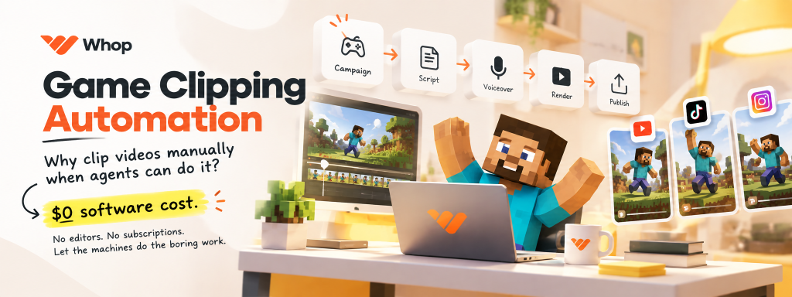

<div align="center">



# Whop Game Clipping

### Why clip videos manually when agents can do it?

**↓ $0 software cost. No editors. No subscriptions. Let the machines do the boring work.**

An automation pipeline for turning raw game footage into short-form content — from campaign rules and scripting to AI voiceover, dynamic subtitles, rendering, and QA.

[](LICENSE)
[](https://www.python.org/)
[](https://ffmpeg.org/)
[](#)

</div>

---

## The idea

Manual clipping is basically:

> download footage → open editor → cut clips → write script → record voice → make subtitles → fix timing → render → check everything → repeat

Why?

This project turns that workflow into a pipeline.

**Campaign in → finished clip out.**

You give the system the campaign, footage, and creative direction. The agents and scripts handle the repetitive production work.

```text
Campaign
   ↓
Rules
   ↓
Script
   ↓
Voiceover
   ↓
Subtitles
   ↓
Video Assembly
   ↓
Render
   ↓
QA
   ↓
Ready to Post
```

The goal isn't to replace creativity.

The goal is to make the boring parts disappear.

---

## What it does

### 🤖 Campaign → Production

The pipeline can take a campaign brief and turn its requirements into an actionable production workflow.

It can extract things like:

- Required game / campaign name
- Mandatory mentions
- Video duration
- Aspect ratio
- CTA requirements
- Prohibited content
- Disclosure requirements
- Submission requirements

No more keeping a 4-page campaign brief open while editing.

---

### ✍️ Script generation

Generate short-form scripts designed around retention.

The included workflow uses a simple 5-beat structure:

```text
01  Hook
02  Constraint
03  Unexpected mechanic
04  Progression
05  Payoff + CTA
```

The idea is simple:

**Don't make the viewer wait for the interesting part.**

---

### 🎙️ AI Voiceover

Generate voiceovers using Google Gemini TTS.

The pipeline supports:

- Gemini voices
- Multiple API keys
- Batch generation
- Silence trimming
- Voice pacing
- Final audio processing

The result is a tightly timed voice track ready for short-form editing.

---

### 💬 Dynamic subtitles

The subtitle engine generates `.ass` subtitles with:

- Word / phrase timing
- Kinetic pop animations
- Bold typography
- High-contrast outlines
- Dynamic emphasis
- Gameplay-friendly positioning

Instead of:

```text
hello guys welcome back
```

you get subtitles designed to actually move with the narration.

---

### ✂️ Automated video editing

The rendering pipeline is built around FFmpeg.

It handles:

- Clip trimming
- Timeline assembly
- Video sequencing
- Audio mixing
- Subtitle rendering
- Vertical composition
- Constant frame rate output
- Color-space handling
- Endcards
- Final encoding

No Premiere timeline required.

No dragging clips around for an hour.

---

### 📱 Vertical short-form output

The pipeline is designed around:

```text
1080 × 1920
9:16
```

for platforms such as:

- TikTok
- YouTube Shorts
- Instagram Reels

Gameplay can be placed inside a vertical composition while preserving important UI elements.

---

### 🔊 Audio mastering

The pipeline also includes audio processing for:

- Silence removal
- Loudness normalization
- Voice/music balancing
- Final audio cleanup

The included workflow targets broadcast-style loudness normalization using EBU R128.

---

### 🔍 Automated QA

Before publishing, the pipeline can validate the final video.

For example:

```bash
python .agents/skills/ffmpeg-skill/scripts/check.py \
  campaigns/how_to_fisch/output/01_final_video.mp4 \
  --platform tiktok
```

Because rendering a video for several minutes only to discover something broke at the end is not fun.

---

# Quick Start

## 1. Clone

```bash
git clone https://github.com/widisaadi/whop-game-clipping.git
cd whop-game-clipping
```

## 2. Install dependencies

```bash
pip install -r requirements.txt
```

A virtual environment is recommended:

```bash
python -m venv venv
```

Activate it:

### Windows

```powershell
venv\Scripts\activate
```

### macOS / Linux

```bash
source venv/bin/activate
```

---

## 3. Configure Gemini

Create your environment file:

### Windows

```powershell
Copy-Item .env.example .env
```

### macOS / Linux

```bash
cp .env.example .env
```

Then add your API key:

```env
GEMINI_API_KEY=your_api_key_here
```

You can get a Gemini API key from Google AI Studio.

> **Cost note:** The repository itself is open-source and free to run. API usage depends on the provider and your account's available free tier / quota. The goal of this project is to keep the software pipeline at **$0 software cost** when used with available free-tier resources.

---

## 4. Install FFmpeg

Make sure FFmpeg is available in your system PATH.

Check:

```bash
ffmpeg -version
```

The pipeline is designed for FFmpeg 6.0+.

---

## 5. Run a dry test

```bash
python scripts/render_retention.py \
  campaigns/how_to_fisch/edits/09_fish_fight_back.json \
  --dry-run
```

If the verification passes, you're ready to start cooking.

---

# Production Workflow

A typical production run looks like this:

```text
┌──────────────────────┐
│   Campaign Brief     │
└──────────┬───────────┘
           ↓
┌──────────────────────┐
│   Rules Extraction   │
└──────────┬───────────┘
           ↓
┌──────────────────────┐
│   Retention Script   │
└──────────┬───────────┘
           ↓
┌──────────────────────┐
│    Gemini TTS        │
└──────────┬───────────┘
           ↓
┌──────────────────────┐
│ Dynamic Subtitles    │
└──────────┬───────────┘
           ↓
┌──────────────────────┐
│   FFmpeg Render      │
└──────────┬───────────┘
           ↓
┌──────────────────────┐
│       QA             │
└──────────┬───────────┘
           ↓
      Ready to Post
```

---

# The 5-Beat Machine

The included content workflow is built around five simple beats.

### 01 — Velocity Hook

**0–2 seconds**

Start immediately.

No:

> "Hey guys, welcome back..."

Instead:

> Give the viewer a reason not to swipe.

---

### 02 — Core Constraint

Introduce the unusual rule, challenge, or problem.

Example:

> "You can't jump."

---

### 03 — The Absurd Tool

Introduce the mechanic that makes the video interesting.

Example:

> A ridiculous tool or game mechanic becomes the only way forward.

---

### 04 — Progression

Escalate.

Make the problem harder.

Make the gameplay more ridiculous.

Make the viewer wonder what happens next.

---

### 05 — Payoff + CTA

Finish the story and transition into the required campaign CTA.

---

# Main Components

| Component | What it does |
|---|---|
| `scripts/gemini_tts.py` | Gemini TTS voice generation |
| `scripts/batch_generate_10_voices.py` | Batch voice generation |
| `scripts/render_retention.py` | Main video rendering pipeline |
| `scripts/align_and_group_phrases.py` | Subtitle timing and phrase grouping |
| `.agents/skills/ffmpeg-skill/scripts/silence.py` | Removes unwanted silence |
| `.agents/skills/ffmpeg-skill/scripts/loudness.py` | Audio loudness normalization |
| `.agents/skills/ffmpeg-skill/scripts/check.py` | Final video validation |

---

# Repository Structure

```text
whop-game-clipping/
│
├── .agents/
│   └── skills/
│       └── ffmpeg-skill/
│
├── assets/
│   ├── clips/
│   ├── sfx/
│   ├── banner.png
│   ├── endcard.png
│   ├── endcard_overlay.png
│   ├── intro_badge.png
│   └── ...
│
├── campaigns/
│   └── <campaign>/
│       ├── assets/
│       ├── edits/
│       └── output/
│
├── prompts/
│   └── campaign_intake.md
│
├── scripts/
│   ├── gemini_tts.py
│   ├── batch_generate_10_voices.py
│   ├── render_retention.py
│   └── align_and_group_phrases.py
│
├── shared/
├── subtitles/
│
├── .env.example
├── AGENTS.md
├── LICENSE
├── README.md
└── requirements.txt
```

---

# Typical Commands

### Generate voiceover

```bash
python scripts/gemini_tts.py
```

### Remove silence

```bash
python .agents/skills/ffmpeg-skill/scripts/silence.py \
  temp/raw_tts.wav \
  --stop-duration 0.10 \
  --stop-threshold -35dB \
  --output temp/voiceover_tight.wav
```

### Generate subtitles

```bash
python scripts/align_and_group_phrases.py
```

### Render final video

```bash
python scripts/render_retention.py \
  campaigns/how_to_fisch/edits/09_fish_fight_back.json
```

### Validate output

```bash
python .agents/skills/ffmpeg-skill/scripts/check.py \
  campaigns/how_to_fisch/output/01_final_video.mp4 \
  --platform tiktok
```

---

# Why this exists

Short-form content rewards volume.

But volume usually means repetition.

More clips means:

- More cutting
- More subtitles
- More voiceovers
- More exports
- More QA
- More time staring at a timeline

This project tries to invert that equation.

```text
Traditional:

Human → Human → Human → Human → Human
         ↓
       Video


This:

Human → Agent → Pipeline → Video
```

You still decide **what should be made**.

The pipeline handles **how the boring parts get made**.

---

# Design Philosophy

### Automate the boring stuff

If a task can be reliably repeated by a script, it probably shouldn't require a human mouse click.

### Keep humans in the creative loop

Automation handles execution.

Humans handle:

- Creative direction
- Story ideas
- Angles
- Taste
- Final approval

### Optimize for iteration

The real advantage isn't making one video faster.

It's being able to make the **next** video without starting from zero.

---

# Cost

### Software

**$0**

This repository is MIT licensed and can be self-hosted.

### Infrastructure

You can run the pipeline locally on your own machine.

### AI

The pipeline supports Gemini API-based generation. Your actual API cost depends on the provider, account, model, quota, and usage.

With available free-tier quotas, you can keep the software workflow at effectively **$0** for experimentation.

---

# Built For

This project is especially useful for:

- Whop Content Rewards
- Game publishers
- Game clipping campaigns
- Roblox creators
- TikTok creators
- YouTube Shorts creators
- Instagram Reels creators
- High-volume short-form production
- Automated content pipelines

---

# Disclaimer

This project is an independent open-source automation tool.

It is not affiliated with, endorsed by, or officially connected to Whop, TikTok, YouTube, Instagram, Google, Roblox, or any game publisher referenced in campaign assets.

Always follow the rules of the campaign, platform, and content rights holder you are working with.

---

# License

MIT License.

See [`LICENSE`](LICENSE) for details.

---

<div align="center">

**Stop dragging clips around. Start shipping them.**

Made for people who'd rather make content than edit timelines.

</div>
